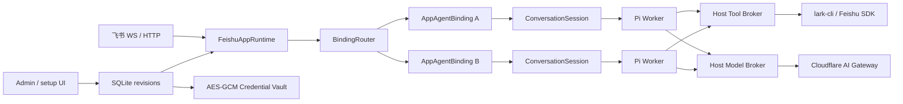

# Feishu Agent Platform 0.1.0

[](https://github.com/BlueSkyXN/Feishu-AgentPlatform/actions/workflows/ci.yml)
[](https://huggingface.co/spaces/BlueSkyXN/feishu-agent-platform-hfs)

Feishu Agent Platform 是一个由 Pi SDK 驱动的飞书多 Agent 运行平台。它把飞书应用、Agent 能力和两者的绑定关系拆开管理，支持：

```text
多个 FeishuApp × 多个 AgentDefinition × 显式 AppAgentBinding × 大量 ConversationSession
```

当前版本以 TypeScript 模块化单体运行，主要部署目标是 Hugging Face Docker Space、Docker Compose 或普通 Linux 服务。

## 核心设计



| 层 | 职责 |
|---|---|
| `FeishuApp` | App 凭据、WS/HTTP 接入、OAuth、飞书准入策略、附件策略 |
| `AgentDefinition` | Prompt、模型协议、Skills、typed tools、Workspace 策略 |
| `AppAgentBinding` | App 与 Agent 的显式关联、默认/命令/群聊/用户/话题路由、会话配额 |
| `ConversationSession` | 同会话串行队列、Pi Session、Worker、Workspace、空闲回收 |
| `SQLite Config Store` | active/draft revision、发布、回滚和审计；空库进入 setup mode |
| `Credential Vault` | AES-256-GCM 密文保存 App/模型等凭据；管理 API 只返回 configured/fingerprint |
| `Admin` | Public `7860` 上的 `/admin` 与 `/api/admin/v1`；Cookie session、CSRF、TTL 和限流 |

一个 App 的所有 Binding 共用一套飞书 Channel、OAuth 和 App 凭据上下文；不会为同一 App 的每个 Agent 重复建立 WS 长连接。

会话键为：

```text
appKey + agentId + tenantKey + chatId + topicKey
topicKey = threadId ?? rootId ?? "main"
```

V1 会话键不自动迁移；本仓库是新平台首次正式落地，直接使用 V2 命名空间。

## 安全边界

- Pi Worker 不接收飞书 Secret、OAuth Token、管理令牌或 Cloudflare Gateway Token。
- Pi Worker 只持有 Host Model Broker 签发、可撤销的内存 capability。
- `lark-cli` 由 Pi 通过 typed tool 发起，但只在可信 Host 执行；Host 注入当前 App 身份。
- `@larksuite/cli@1.0.79` 是由 `package-lock.json` 固定的 production dependency；Host 从本项目 `node_modules/.bin` 启动它并初始化独立 bot profile，每个 operation 固定命令、参数 schema、effect 和 approval，使用 `shell: false`、当前聊天边界、超时、输出上限和脱敏。
- V0.1 对飞书业务数据严格只读；配置中的 typed Feishu write tool 或非只读 `lark-cli` operation 会在 YAML、Admin Validate/Publish/Rollback、`platformctl config import --publish` 和启动加载时被服务端拒绝。普通 `config import` 可保存尚未通过语义校验的中间 Draft，但后续 Validate/Publish 必须通过同一门禁。`workspace.write` 仅是受路径与配额约束的本地 Conversation Workspace 能力，不属于飞书外部写。
- Admin 登录只有在 socket peer 精确匹配 `ADMIN_TRUSTED_PROXY_ADDRESSES` 时才读取 `X-Forwarded-For` 第一跳；该变量为空时不信任任何代理，不能用通配地址换取表面上的客户端 IP。
- 配置 revision、审计和加密 Vault 位于 `/data/feishu-agent-platform/platform.db`；`PLATFORM_MASTER_KEY` 不写入数据库、日志或 Worker。
- Sandbox 只有 `WorkspaceGuard`：`none`、`read-only`、`read-write`。
- `workspace.root/sessionRoot` 必须留在 resolved `DATA_ROOT` 内；Workspace 拒绝绝对路径、`..`、NUL、symlink 逃逸，并以 `maxTotalBytes=268435456`、`maxFiles=10000` 限制会话持久目录总量。
- 飞书附件按每 Turn 的 `maxItems/maxBytesPerItem/maxTotalBytes` 独立限流；下载过程中逐 chunk 计数，超限立即中止，不用 Workspace 总容量替代单 Turn 附件预算。
- 项目不包含 Shell、PTY、SSH、SCP、SFTP、远程 Sandbox、MicroVM 或 Python/JavaScript Code Runner。

## 快速开始

要求 Node.js `>=22.19.0`，建议 Node.js 24。

```bash
npm ci
npm run check
npm run build

cp .env.example .env
npm start
```

先在 `.env` 中至少设置随机 `ADMIN_TOKEN` 与 `PLATFORM_MASTER_KEY`。数据库为空时服务进入 setup mode：`/healthz` 与 `/readyz` 均返回 HTTP 200，后者的 `status` 为 `setup_required`；通过 HTTPS 打开 `/admin` 创建 Draft、配置 Vault 并发布 active revision。管理 Cookie 固定为 `Secure`，不要用明文 HTTP 暴露管理台。

也可在受控环境先把 `*.yaml.example` 复制为 active manifests，填入 seed 所引用的 Secret，再运行 `platformctl validate`。仓库检查必须在创建 `.env` 和 active YAML **之前**执行，因为它们按策略不得进入源码交付。

示例配置展示了：

- `primary` App 同时绑定 `general` 和 `office` Agent；
- `/office` 前缀把消息路由到 `office`；
- `office` Agent 同时复用于 `primary` 和 `secondary` 两个 App。

实际配置文件默认被 `.gitignore` 忽略；仓库只提交 `*.yaml.example`。Workspace、Session、OAuth、lark-cli profile 和 SQLite 都默认回落到 `DATA_ROOT`；自定义 `workspace.root/sessionRoot` 也不得逃出该根。容器/HF 的卷挂载点为 `/data`，应用数据根为 `/data/feishu-agent-platform`。

## Model Broker

默认生产策略是：

```text
Pi Worker
  -> 127.0.0.1 Host Model Broker
  -> Cloudflare AI Gateway
  -> OpenAI / Anthropic 等 Provider
```

最小环境变量：

```dotenv
CLOUDFLARE_ACCOUNT_ID=...
CLOUDFLARE_GATEWAY_ID=...
CLOUDFLARE_API_KEY=...
MODEL_BROKER_ENABLED=true
MODEL_PROVIDER_POLICY=host-broker-only
```

Cloudflare 上游 Provider Key 建议放在 AI Gateway 的 Stored BYOK/Secrets Store 中，不进入本服务。

## 常用命令

```bash
npm run platformctl -- doctor
npm run platformctl -- validate
npm run platformctl -- list
npm run platformctl -- config export config-export.json --slot=active
npm run platformctl -- config import config-export.json
npm run platformctl -- config backup platform-backup.db
npm run platformctl -- config restore platform-backup.db --confirm=RESTORE
npm run typecheck
npm test
npm run build
npm run check
npm run hf:preflight
```

## HTTP

- Public：`0.0.0.0:7860`，提供飞书 HTTP Events/Callbacks、OAuth、`/admin`、`/api/admin/v1`、`/healthz`、`/readyz`。
- Internal：`127.0.0.1:8788`，提供状态、Apps、Agents、Bindings、Sessions、指标和会话控制。
- Model Broker：`127.0.0.1:8790`，只接受内存 capability，不向公网暴露。

## 文档

从 [docs/README.md](docs/README.md) 进入完整文档。重点包括：

- [架构](docs/ARCHITECTURE.md)
- [配置](docs/CONFIGURATION.md)
- [飞书设置](docs/FEISHU_SETUP.md)
- [工具与 lark-cli](docs/TOOLS.md)
- [WorkspaceGuard](docs/SANDBOX.md)
- [Cloudflare AI Gateway](docs/CLOUDFLARE_AI_GATEWAY.md)
- [Hugging Face Space](docs/HUGGING_FACE_SPACE.md)
- [GitHub Actions CI/CD](docs/GITHUB_ACTIONS.md)
- [功能预览与验收](docs/PREVIEW.md)
- [管理台与 setup mode](docs/ADMIN.md)
- [安全边界](SECURITY.md)

## 当前验证边界

正式交付以 GitHub Actions `CI/CD` 为准：同一个 immutable Commit 先通过 source matrix 和 production image smoke，再自动部署 HF Space并等待 repo/runtime SHA、`RUNNING`、域名 `READY`、`/healthz`、`/readyz` 和 `/admin` 回读。开发机输出和本地 ZIP 不构成交付证据。真实飞书 App、Cloudflare AI Gateway、WS/HTTP、OAuth、SQLite/Vault 重启恢复和长期压力运行仍属于目标环境验收。

许可证：仓库整体按根目录 [GPL-3.0](LICENSE) 分发；迁入的旧 MIT 底座保留在 [LICENSES/feishu-pi-agent-host-MIT.txt](LICENSES/feishu-pi-agent-host-MIT.txt)。
