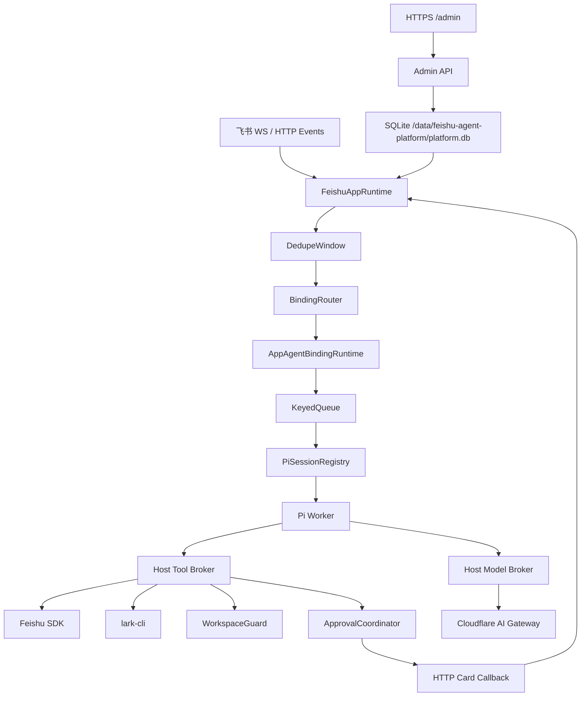

# 架构

## 领域模型

```text
PlatformHost
├── SQLite Config Store / Credential Vault
├── Public Admin / setup mode
├── FeishuAppDefinition 1..N
├── AgentDefinition 1..N
├── AppAgentBinding N..N
└── ConversationSession N..N
```

`FeishuAppDefinition` 与 `AgentDefinition` 不直接包含对方的数据。`AppAgentBinding` 是唯一关联边，负责路由和会话策略。

YAML examples/active manifests 是 seed 或受控文件配置输入；运行配置以 SQLite active revision 为准。数据库为空时只启动 setup 管理面，发布 active revision 后再启动业务 App。

## 运行时



每个 `FeishuAppRuntime` 只创建一套 WS/HTTP Channel、OAuth、去重窗口和 App 凭据上下文。绑定多少 Agent 都不会重复连接同一 App。

每个 `AppAgentBindingRuntime` 独立拥有：

- 按会话串行的 `KeyedQueue`；
- Binding 并发 `Semaphore`；
- `PiSessionRegistry`；
- identity/history 策略；
- resolved Tool Broker policy。

## Binding 路由

每个 App 必须且只能有一个 default Binding。非 default Binding 至少配置一个条件：

- `commandPrefixes`
- `chatAllowlist`
- `userAllowlist`
- `threadAllowlist`

同一条 Binding 的非空 allowlist 按 AND 语义匹配。排序依次比较：

1. `priority`；
2. 命令前缀长度；
3. 生效条件数量。

最高分并列时拒绝路由并提示用户，不使用文件顺序或随机选择。命令前缀在消息进入 Pi 前由 Host 删除。

## 会话隔离

```text
v2:
appKey + agentId + tenantKey + chatId + topicKey
```

所有 segment 使用 base64url 编码，持久目录使用会话键的 SHA-256 截断值。Workspace 与 Session 目录为：

```text
<DATA_ROOT>/workspaces/<appKey>/<agentId>/<storageId>
<DATA_ROOT>/sessions/<appKey>/<agentId>/<storageId>
```

显式 `workspace.root/sessionRoot` 经 `resolve` 后也必须等于或位于 resolved `DATA_ROOT` 内。Workspace 持久总量默认受 `maxTotalBytes=268435456` 和 `maxFiles=10000` 限制；它与单 Turn 附件预算分开计算。即使 active 配置已删除所属 Agent，持久索引中的 orphan Session 仍可在路径身份和 `DATA_ROOT` containment 校验通过后清理。

同一 key 串行，不同 key 可并行；全局、Binding、队列等待、单 Turn 和单 Tool 都有独立上限。空闲 Session 按 TTL 回收，超过驻留上限时只淘汰未占用且未流式生成的最久空闲项。

## Pi Worker 与工具

每个活跃 Session 默认使用独立 Pi Worker。Pi 内置工具全部关闭，只注册 Host catalog 中的 custom tools。

```text
Pi custom tool
  -> IPC tool_request
  -> ProcessAgentSession
  -> ToolBroker
  -> SDK / lark-cli / WorkspaceGuard
```

飞书/OAuth 凭据只存在 Host。`@larksuite/cli@1.0.79` 作为 lockfile 固定的 production dependency 在 Host 使用每 App 独立 strict bot profile；V0.1 的统一配置加载器只允许飞书只读工具与 CLI operation。

飞书图片/文件由 Host Lark Channel 以 bounded stream 下载。Header 超限先拒绝，实际 stream 逐 chunk 计数并在超过本项/本 Turn 剩余预算时销毁；只有完整资源才计入 total，并以安全相对路径写入当前 Conversation Workspace。

## Model Broker

```text
Pi Worker
  -> Authorization: Bearer <session capability>
  -> 127.0.0.1:8790
  -> cf-aig-authorization: Bearer <Gateway Token>
  -> Cloudflare AI Gateway
```

Worker 使用 session-local `agent-runtime` 目录和 `InMemoryCredentialStore`，不读取共享 Pi `auth.json/models.json`。capability 具有 TTL/绝对最大生命周期，Session 释放时撤销。

## 配置与 Vault

`/data/feishu-agent-platform/platform.db` 保存 immutable revisions、active/draft slot、audit 和 AES-GCM credential envelope。Admin API 只返回 credential configured/fingerprint；Trusted Host resolver 才能解密。`PLATFORM_MASTER_KEY` 由部署 Secret 提供，不存入数据库。

## 多实例

按 `hash(appKey) % APP_SHARD_COUNT` 分片。每个 App 使用平台 SQLite 中的 `feishu-app:<appId>` 原子租约，保证共享同一数据库的 Host 只有一个活动长连接实例。HF 首版仍按单实例部署；跨机器扩展前必须改用真正共享的一致性数据库，且 Session 与 Workspace 也需要共享存储。
